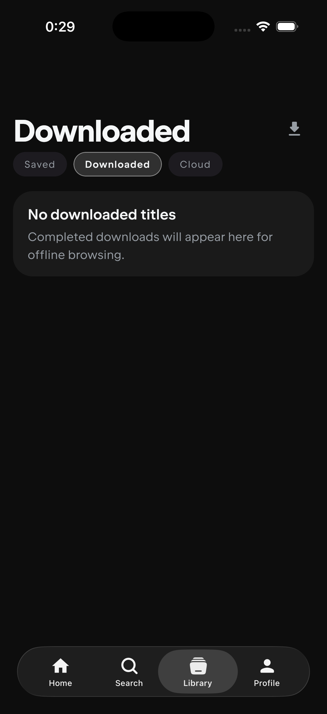
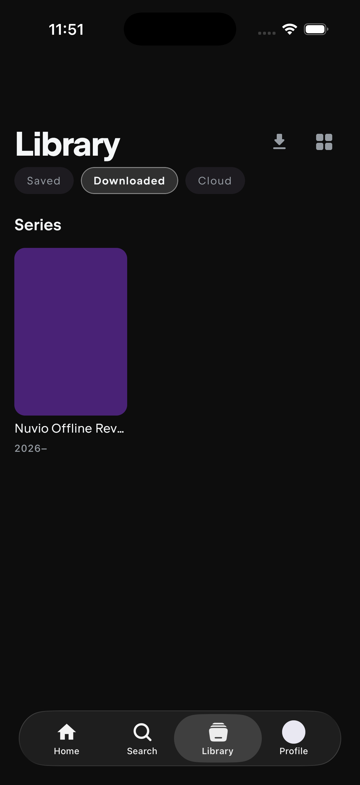
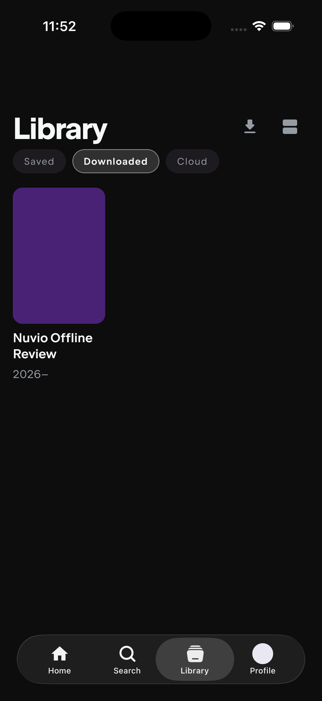

# F02 Offline Library polish review

## Scope

This follow-up starts from `08dee1be78dfa8032d3b860e0a0be2b40b729897` on `codex/testflight-internal`, after the original F02 pull request was merged. It completes the remaining physical-device review items without changing the download database schema.

## Behavior

- Offline artwork now includes photos for up to the first 16 cast members that have a photo URL. The poster, background, and logo remain first in the artwork plan, followed by cast, season, and downloaded-episode artwork.
- Existing downloaded titles are reconciled against the expanded artwork plan. A record produced by the earlier build becomes artwork-incomplete when cast photos are missing, then performs the existing artwork-only refresh the next time Home or Library is online. The title and media do not need to be downloaded again.
- Offline details resolve each cached cast photo to its local file. Missing or failed photos continue to use the existing remote URL and artwork retry policy.
- Saved Library items reuse verified local poster, backdrop, and logo files from a matching downloaded title. The Saved item keeps its original ID, type, and navigation data.
- Downloaded uses the same horizontal shelves and vertical poster grid as Saved, including the top-right layout control. It omits Saved's filter and sort row because downloaded collections are intentionally small. Movies and series remain separate shelves in horizontal mode, while the vertical view combines every downloaded title in recent-download order.
- Downloaded ordering uses the newest completed, playable download for each title. Downloading a new episode moves an older series to the front in both layouts, while an active or incomplete download does not reorder it prematurely.
- The Downloaded tab now keeps `Library` as the screen title and no longer adds another `Downloaded` heading below the source selector.
- Saved keeps its persisted filter and sort preferences. Downloaded shares only the persisted horizontal or vertical layout preference.
- Saved artwork matching keeps numeric provider IDs in their namespaces. Exact stable IDs and `tmdb:` or `trakt:` aliases still match, while an equal TMDB and Trakt number cannot borrow artwork from the wrong title.

## Validation

| Check | Result |
|---|---:|
| Focused Android host suites | 2 suites, 30 tests, 0 failures, 0 errors, 0 skipped |
| Full Android host suite | 149 suites, 941 tests, 0 failures, 0 errors, 0 skipped |
| Focused iOS simulator suites | 2 suites, 30 tests, 0 failures, 0 errors, 0 skipped |
| Default iOS player regression harness | 15 suites, 126 tests, 0 failures, 0 errors, 0 skipped |
| Full Android debug app build | Passed |
| Full iOS simulator app build | Passed |
| iOS simulator Library runtime review | `Library` header, Downloaded horizontal shelves, layout button, clean control-free content area, and Downloaded vertical grid verified |
| Diff whitespace check | Passed |

The focused tests cover local artwork reuse by matching Saved items, namespace-safe provider IDs, and Downloaded ordering across multiple titles in both layouts. The ordering regression also verifies that the newest playable episode wins and a newer active download is ignored. The full suites continue to cover the bounded cast artwork plan, automatic reconciliation of records created by an older build, and the native iOS artwork filesystem implementation.

## Visual evidence

Before, Downloaded replaced the screen title and did not expose the Library layout action:

After, Downloaded keeps the Library title and supports the shared horizontal shelves and vertical grid:

## Physical-device review

After installing the updated build, open Home or Library once while online. Existing downloads with cast metadata will fetch their missing cast images through the normal background artwork refresh. Then disconnect and verify the cast row, Saved poster, Downloaded horizontal shelves, and Downloaded vertical grid without a filter row. Download a new episode of an older series and confirm that title moves to the front in both Downloaded layouts after completion. Cast members without a source photo will continue to show the ordinary placeholder. Namespace collision handling is covered by the automated regression because it depends on provider metadata that is not exposed in the UI.

## Rollback

Revert the commits in this follow-up. No database migration or cleanup is required. Previously cached cast image files become unreferenced and are removed by the existing offline artwork cleanup path.
