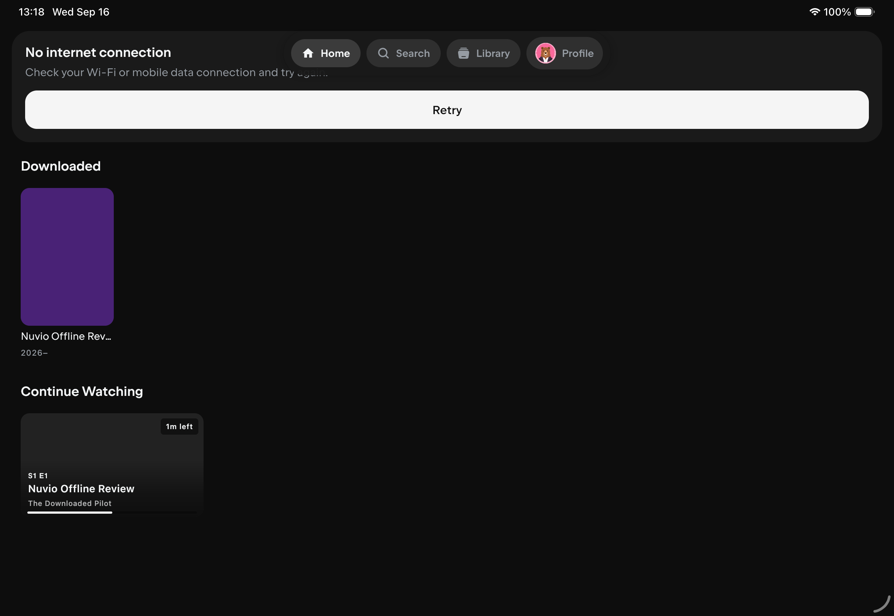
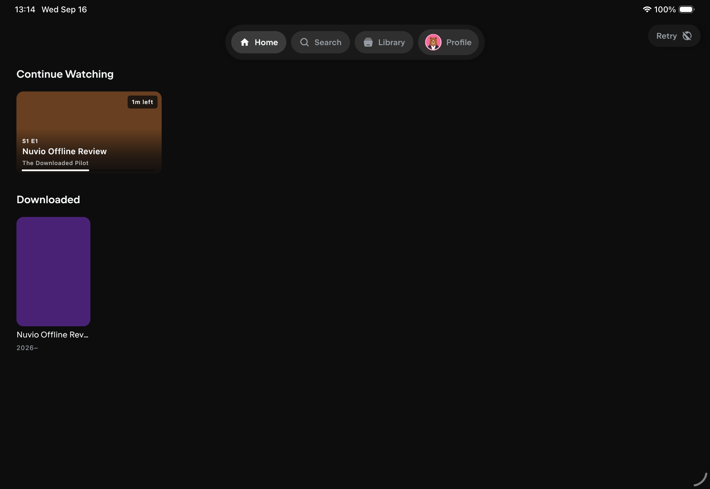
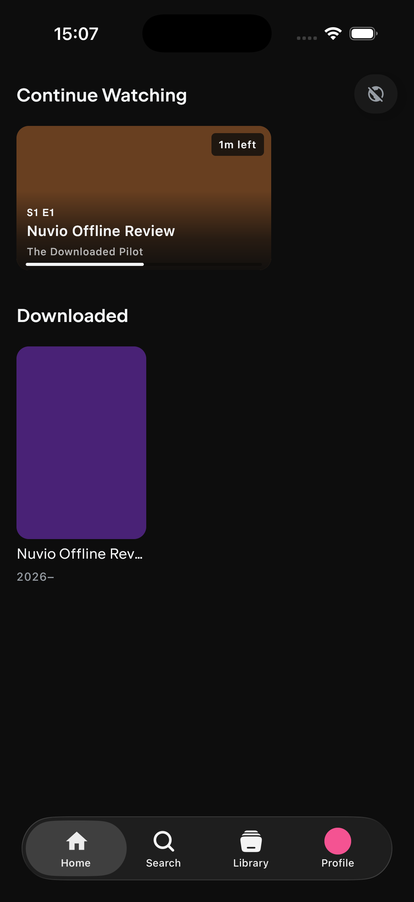

# F03 Offline Home review

## Scope

This follow-up started from `08dee1be78dfa8032d3b860e0a0be2b40b729897` on `codex/testflight-internal` and now includes the current base through `01e3bf9b`, including merged PR 19. It fixes the offline Home behavior documented in [NuvioMedia/NuvioMobile#1968](https://github.com/NuvioMedia/NuvioMobile/issues/1968) without changing download storage or playback behavior.

## Behavior

- On landscape tablets, a connection failure now appears as a compact Nuvio pill at the top right of the root Home, Search, Library, and Profile tabs. The pill keeps `Retry` to the left of a crossed-globe icon, exposes the connection state in a tooltip, and triggers the existing forced network refresh.
- On phones, the same root connection state remains reachable as an icon-only pill at the top right. Its accessibility action is labeled `Retry`, keeping the control useful without restoring the large connection card over playable local content.
- The status pill is limited to root tabs. Details and playback screens do not show it.
- Root tab content receives enough top clearance for the floating navigation, preventing Home content and connection messaging from sitting underneath the tab bar.
- Offline Home shows Continue Watching first and Downloaded second. Downloaded remains an offline-only row, while the remote hero, catalog rows, and collection rows stay out of the offline layout.
- The large connection card is reserved for the empty offline state, when neither resumable downloaded content nor a playable download is available.
- Offline Continue Watching cards resolve matching downloaded artwork from verified local files. Episode artwork is preferred, followed by the local background and poster. Remote image fields are cleared when a matching offline title has no local value, so a disconnected card does not keep retrying inaccessible URLs.
- The existing poster-card option is available at **Settings → General → Layout → Continue Watching → Card Style → Poster**. The page is named `Appearance` internally, but its English UI label is `Layout`.

## Validation

| Check | Result |
|---|---:|
| Focused Android host suite | 4 suites, 69 tests, 0 failures, 0 errors, 0 skipped |
| Focused iOS simulator suite | 4 suites, 69 tests, 0 failures, 0 errors, 0 skipped |
| Full Android debug app build | Passed |
| Full iOS simulator app build | Passed |
| Portrait iPhone runtime review | Icon-only top-right offline status with accessible Retry action, no large connection card, Continue Watching first, and Downloaded second verified with playable local content |
| Landscape iPad runtime review | Labeled top-right Retry pill, unobstructed navigation, Continue Watching first, local episode artwork, Downloaded second, and no remote catalog verified |
| Diff whitespace check | Passed |

The focused tests cover offline Continue Watching filtering, local artwork replacement and fallbacks, preservation of playback progress, root-only visibility for connection failures, the phone compact-status presentation when Home suppresses its large connection card, the wide-tablet Retry pill, and the merged Downloaded ordering and artwork-identity regressions.

## Visual evidence

Before, the full connection card overlapped the navigation area, Downloaded preceded Continue Watching, and the resumable card could not use the matching locally cached image:

After, Retry is a compact top-right pill and the locally useful rows are ordered for offline playback:

On phones with playable local content, the connection state remains available as a compact icon-only Retry control without displacing the two offline rows:

## Physical-device review

On an iPad in landscape, download an episode, play part of it, then disconnect and open Home. Verify that Continue Watching uses the downloaded episode image, appears above Downloaded, and resumes playback. Confirm that the labeled Retry pill appears on each root tab, has a connection tooltip, and disappears on a title details screen. Repeat on an iPhone and confirm that the smaller crossed-globe control remains visible and invokes Retry while the large connection card stays hidden.

## Rollback

Revert the follow-up commits. No database migration or offline-file cleanup is required.
